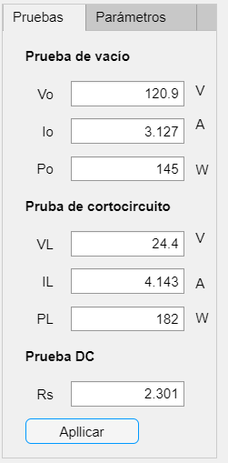
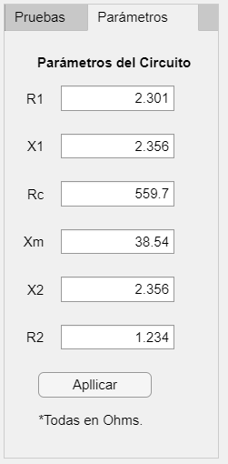
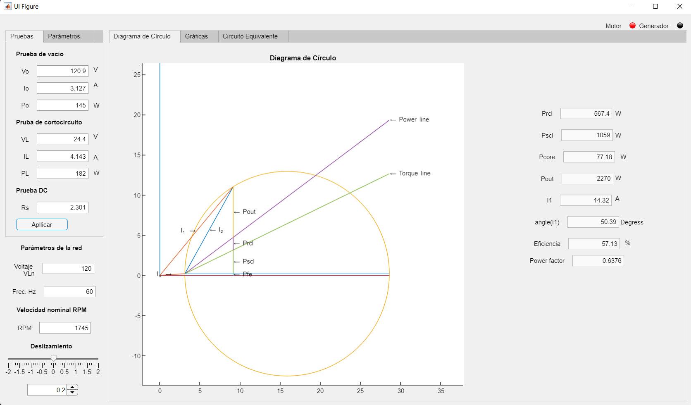
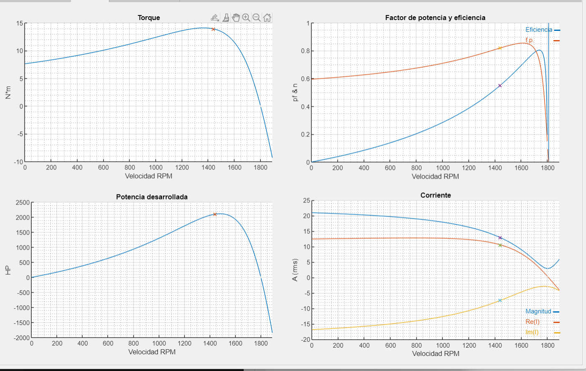
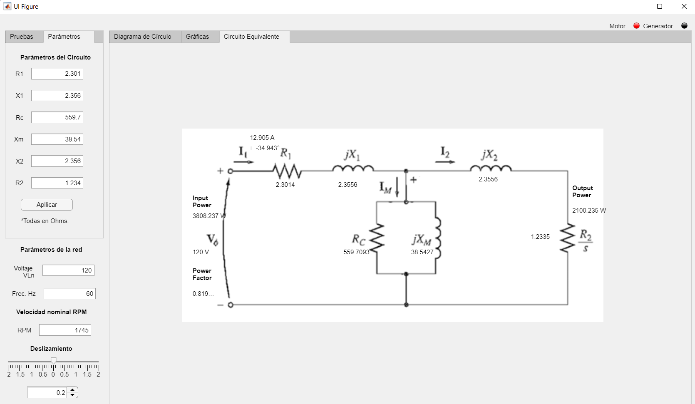

# CircleDiagramApp

By: [Jimmy Palomino](https://www.linkedin.com/in/jimmypalomino/, 'LinkedIn')

## Description

Simulate a Induction Motor and know its characteristics like as the torque, current, power, PF for different slips(speeds), all this using the machine parameters or the test data.

# Input test data Parameter

Fill in all the tests data and click on `Apply`

# Input motor Parameter

Fill in all the parameters and click on `Apply`

This process also calculates the machine parameters.

# Circle diagram

Based on the input, the program draw a diagram circle and the data for the other windows.

To run click on `apply`

With the sliping bar in the left corner of the wondows, it is posible  to simulate to diferent values of slip `s`. 

# Characteristic graphics

Here you can found the data for the torque, current, pf, and power developed by the machine.

# Machine Diagram 
Draws the Machine Diagram with the machine states; current, voltages, and powers. 

# Requirements
MatLab >= 2021a

# Developer

Jimmy Palomino 
[LinkedIn](https://www.linkedin.com/in/jimmypalomino/)
